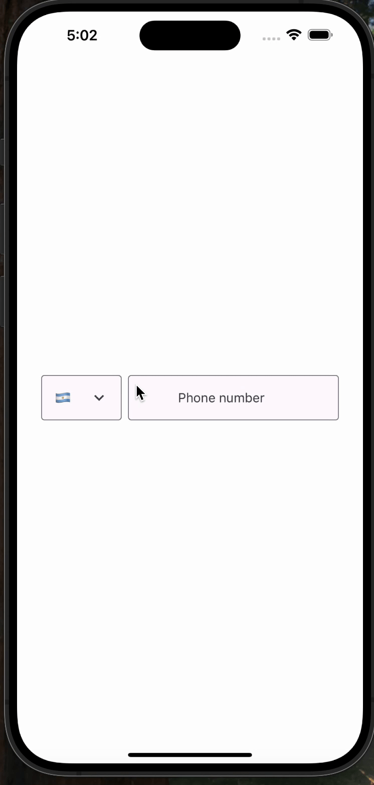

# React Native Paper Phone Input Component

## PhoneInput Component

A customizable and modern phone input field for React Native, built on top of **[react-native-paper](https://github.com/callstack/react-native-paper)** components. It includes an inline country picker, phone number formatting (via **libphonenumber-js**), and a flexible API for easy integration.

## Features

- **Built-in country picker** that can be toggled on/off  
- **Country code selector** with optional labels  
- **Automatic phone number formatting** powered by [libphonenumber-js](https://github.com/catamphetamine/libphonenumber-js)  
- **React Native Paper**-based UI, allowing seamless integration with the Paper theme  
- **Customizable** via props for labels, placeholders, styles, and more

## Preview



## Installation

1. Install **react-native-paper** (if you haven’t already):
   ```bash
   npm install react-native-paper
   # or
   yarn add react-native-paper
   ```

2. Install **react-native-paper-phone-input** (if you haven’t already):
   ```bash
   npm install react-native-paper-phone-input
   # or
   yarn add react-native-paper-phone-input
   ```

3. Add `<PaperProvider>` to your app.
```tsx
import { Provider as PaperProvider } from 'react-native-paper';

const App = () => (
  <PaperProvider>
    <PhoneInput />
  </PaperProvider>
);
```

## Usage

Below is a basic usage example:

```tsx
import React, { useState } from 'react';
import { View } from 'react-native';
import PhoneInput from './PhoneInput';

export default function MyScreen() {
  const [phoneNumber, setPhoneNumber] = useState('');

  return (
    <View style={{ padding: 16 }}>
      <PhoneInput
        defaultCountry="US"
        value={phoneNumber}
        onChangePhone={(formattedPhone) => setPhoneNumber(formattedPhone)}
      />
    </View>
  );
}
```

### Example with Custom Labels and Styles

```tsx
<PhoneInput
  inputLabel="Mobile Number"
  countryPickerLabel="Pick a Country"
  inputPlaceholder="(555) 555-5555"
  defaultCountry="CA"
  value={phoneNumber}
  onChangePhone={(formattedPhone) => setPhoneNumber(formattedPhone)}
  withLabels={true}
  withCountryPicker={true}
  containerStyle={{ marginVertical: 12 }}
  inputStyle={{ backgroundColor: '#f8f8f8' }}
  countryPickerStyle={{ backgroundColor: '#f8f8f8' }}
/>
```

## Props

| Prop Name               | Type                                   | Default               | Description                                                                                                         |
| ----------------------- | -------------------------------------- | --------------------- | ------------------------------------------------------------------------------------------------------------------- |
| **`inputLabel`**        | `string`                               | `'Phone number'`      | The label for the phone input TextField (displayed above the input if `withLabels` is true).                        |
| **`countryPickerLabel`**| `string`                               | `'Country'`           | The label for the country picker TextField (displayed above the picker if `withLabels` is true).                    |
| **`inputPlaceholder`**  | `string`                               | `'Phone number'`      | Placeholder text for the phone number input.                                                                        |
| **`defaultCountry`**    | `CountryCode` (ISO code)               | `'US'`                | Default selected country code (e.g. `'US'`, `'CA'`, `'GB'`).                                                        |
| **`value`**             | `string`                               | `''` (empty)          | The current phone number value.                                                                                     |
| **`onChangePhone`**     | `(phone: string) => void`              | `undefined`           | Callback invoked when the phone number changes, receiving the formatted value.                                      |
| **`inputStyle`**        | `StyleProp<TextStyle>`                 | `undefined`           | Style object applied to the phone input TextField.                                                                  |
| **`withLabels`**        | `boolean`                              | `true`                | Whether to show labels above the input fields.                                                                      |
| **`withCountryPicker`** | `boolean`                              | `true`                | Whether to show the country picker field.                                                                           |
| **`withCountryPickerChevron`** | `boolean`                              | `true`                | Whether to show the chevron icon in the country picker field.                                                                           |
| **`withSelectedCountryCode`** | `boolean`                              | `false`                | Whether to show the selected country code in the country picker field.                                                                           |
| **`countryPickerStyle`**| `StyleProp<TextStyle>`                 | `undefined`           | Style object applied to the country picker TextField.                                                               |
| **`containerStyle`**    | `StyleProp<ViewStyle>`                 | `undefined`           | Style object applied to the root container.                                                                         |

## Functions & Methods

- **Phone Number Formatting**: Leveraging **`AsYouType`** from **libphonenumber-js** to format the entered number based on the selected country’s dial code.  
- **`onSelect`**: Internal callback when a country is selected, updating local state.  
- **`handleChangeText`**: Internal handler to format the phone number and call `onChangePhone`.

## Theming

Because this component uses **react-native-paper**, it respects the Paper theme:

- The **`selectionColor`** defaults to `theme.colors.primary`.
- You can override `TextInput` themes or styles through the Paper [Theme API](https://callstack.github.io/react-native-paper/theming.html).

## Contributing

1. **Fork** the repository.
2. **Create** your feature branch: `git checkout -b feature/my-new-feature`.
3. **Commit** your changes: `git commit -m 'Add some feature'`.
4. **Push** to the branch: `git push origin feature/my-new-feature`.
5. **Open a Pull Request** on GitHub.

## License

This component is open-source. You may distribute or modify it under the terms of the [MIT License](./LICENSE) (or whichever license you choose for your repo).

---

**Enjoy building with `PhoneInput`!** If you have any questions or run into issues, feel free to open an issue or submit a pull request. Happy coding!
